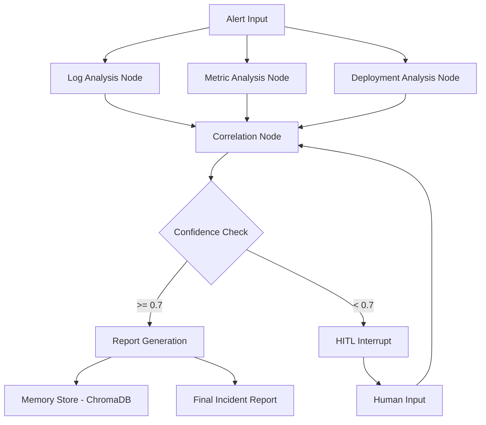

# Aegis: Autonomous Incident Response Platform (AIRP)

Autonomous agent that investigates production incidents across logs, metrics, and deployment history — reducing manual triage time from 30 minutes to under 3 minutes.

## Demo


<!-- Record: trigger alert → watch agent investigate → see report generate → trigger HITL on INC-016 → provide input → watch resume -->

## The Problem

When production systems fail, on-call engineers waste critical downtime manually correlating scattered logs, monitoring dashboards, and deployment histories to form a hypothesis. Without an automated investigator, root cause analysis is a slow, error-prone human bottleneck that extends Mean Time to Resolution (MTTR).

## Architecture



## Key Engineering Decisions

Decision: LangGraph over simple chains
Alternative: LangChain LCEL or standard sequential pipelines
Why: Incident response requires cyclical reasoning and state management. LangGraph enables cyclic edges, allowing the agent to pause execution, request human input, and resume with intact state memory.

Decision: Python-calculated confidence over LLM-generated
Alternative: Prompting the LLM to output a confidence score from 0-100
Why: LLMs are notoriously poor at self-calibration and often express unwarranted certainty. Calculating confidence deterministically in Python based on the presence of required technical fields (core cause, technical details, chain of events) prevents hallucinated high-confidence scores.

Decision: LLM-as-judge evaluation over cosine similarity
Alternative: Vector cosine similarity between generated hypothesis and ground truth
Why: Cosine similarity often scores semantically similar but technically incorrect answers high (e.g., "memory leak in v1" vs "memory leak in v2"). An LLM judge evaluates the specific logical components of the root cause, ensuring the agent identified the exact failing component and chain of events.

Decision: Sequential node execution over parallel
Alternative: Parallel execution of log, metric, and deployment nodes
Why: Parallel execution triggered immediate rate limit exhaustion on free-tier LLM APIs by sending three simultaneous requests. Sequential execution avoids concurrency limits at the cost of slight latency increases.

Decision: ModelRouter with priority fallback over single API
Alternative: Direct LangChain model initialization
Why: API rate limits cause complete system failures during high-volume evaluations. The ModelRouter catches rate limit exceptions and automatically falls back to secondary models, ensuring continuous operation during traffic spikes.

## Evaluation Results

| Metric | Result |
|--------|--------|
| Total Incidents | 20 |
| Root Cause Accuracy | 80% |
| Automation Rate | 80% |
| HITL Trigger Rate | 20% |
| Mean Confidence | 77.5% |
| Evaluation Method | LLM-as-Judge |

I use LLM-as-judge rather than cosine similarity because incident root causes demand precise technical accuracy, not just semantic overlap. A cosine similarity check might assign a 0.90 score if the agent blames a database timeout instead of a Redis timeout, since both are datastore timeouts. An LLM configured as a strict judge evaluates whether the agent accurately identified the specific service, version, and cascading failure chain, providing a reliable measure of true operational accuracy.

## Smart Model Failover

The system uses a custom `ModelRouter` to handle API rate limits without halting execution. When the primary provider rejects a request due to exhaustion, the router catches the exception and immediately retries the request using the next available model in the hierarchy. The router state resets on each new incident investigation to ensure primary models are always prioritized when available.

| Priority | Provider | Model | Condition |
|----------|----------|-------|-----------|
| 1 | Groq | Llama 3.3 70B | Primary default |
| 2 | Groq | Llama 3.3 70B | Retry on transient failure |
| 3 | OpenAI | GPT-4o-mini | Fallback on Groq rate limit |
| 4 | Gemini | Gemini 1.5 Flash | Fallback on OpenAI rate limit |

## Known Limitations & Failure Modes

1. Low confidence incidents (INC-016 to INC-019)
These incidents lack sufficient signals in the raw logs and metrics for an autonomous decision. The agent correctly identifies the ambiguity and halts execution to request human input, preventing a hallucinated root cause.

2. Rate limit cascading
When evaluating multiple incidents rapidly, all configured LLM providers can exhaust their rate limits simultaneously. The router currently implements a 60-second blocking sleep when all 4 models fail, which delays real-time processing during massive alert storms.

3. Synthetic data limitations
The evaluation dataset relies on generated JSON logs which are cleaner and more structured than real production environments. True production logs contain significantly more noise, unstructured stack traces, and formatting inconsistencies that challenge the retrieval nodes.

4. Sequential execution tradeoff
Analyzing logs, metrics, and deployments sequentially takes approximately 15-20 seconds per incident. Parallel execution would reduce this to 5 seconds, but remains disabled to prevent bursting free-tier API quotas.

## Tech Stack

| Component | Technology | Purpose |
|-----------|------------|---------|
| Orchestration | LangGraph | Manages stateful cyclical execution and human-in-the-loop pausing |
| Primary LLM | Groq (Llama 3.3) | Provides fast, low-latency reasoning for log and metric analysis |
| Fallback LLMs | OpenAI / Gemini | Ensures high availability when primary models hit rate limits |
| Vector Store | ChromaDB | Embeds and retrieves past incident reports for historical context |
| Data Validation | Pydantic | Enforces strict JSON schemas for all LLM outputs to prevent parsing errors |
| Evaluation | LLM-as-Judge | Scores agent accuracy against ground-truth datasets |

## Setup

1. **Clone the repository**
   ```bash
   git clone https://github.com/Bhavesh-Verma-git/AIRP.git
   cd AIRP
   ```

2. **Install dependencies**
   ```bash
   pip install -r requirements.txt
   ```

3. **Configure environment variables**
   Create a `.env` file in the root directory:
   ```env
   GROQ_API_KEY=your_groq_key
   OPENAI_API_KEY=your_openai_key
   GEMINI_API_KEY=your_gemini_key
   ```

4. **Run a single incident test**
   ```bash
   python main.py
   ```

5. **Run the full evaluation suite**
   ```bash
   python eval/evaluate.py
   ```

## Project Structure

- `agents/`: Contains the LangGraph nodes, LLM routing logic, and state definitions.
- `api/`: FastAPI routes for exposing the agent's endpoints and Server-Sent Events.
- `config.py`: Centralized configuration for LLMs, thresholds, and execution modes.
- `dashboard/`: Static HTML/JS frontend for the real-time human-in-the-loop interface.
- `data/`: Stores synthetic incident logs and metrics used for evaluation.
- `eval/`: Contains `evaluate.py` for running the LLM-as-judge batch evaluation.
- `graph/`: Defines the LangGraph edges, conditional routing, and compilation logic.
- `main.py`: Entry point for starting the FastAPI server and local testing.
- `memory/`: Houses the local ChromaDB vector store for past incident retrieval.
- `observability/`: Contains integration logic for logging traces to Langfuse.
- `tools/`: Utility functions for fetching simulated logs, metrics, and deployments.
