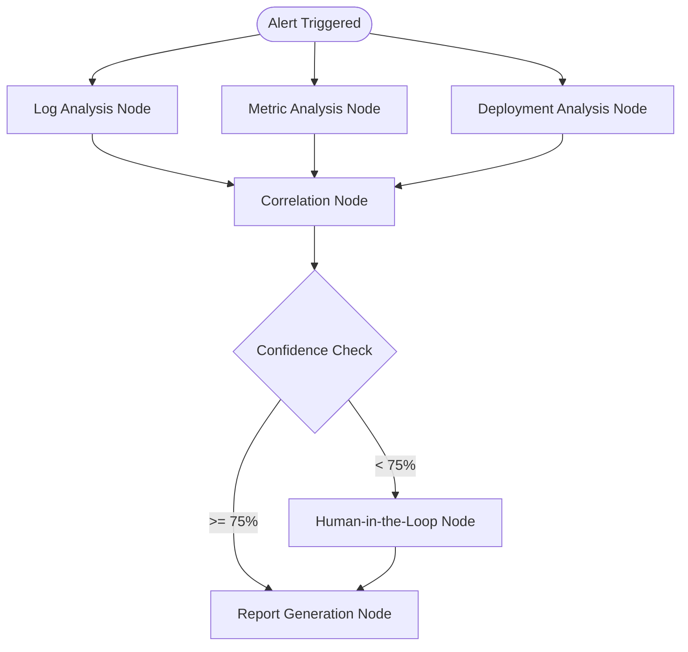

# 🛡️ Aegis: Autonomous Incident Response Platform (AIRP)

**Problem:** On-call engineers spend hours manually triaging alerts, grepping through distributed logs, and matching metrics before they can even begin to formulate a root-cause hypothesis. 

**Solution:** Aegis is an AI-powered, stateful graph agent that autonomously investigates alerts in real-time. It retrieves relevant logs, metrics, and past incidents using RAG, formulates a confidence-scored hypothesis, and either generates a complete incident report or routes the investigation to a human-in-the-loop (HITL) dashboard via Server-Sent Events (SSE).

## 🧠 Architecture


## 🏗️ Key Engineering Decisions

1. **Stateful Graph (LangGraph) over Linear Chains**
   Incident response is inherently non-linear and cyclical. An agent might pull logs, realize it needs a broader timeframe, and need to loop back. Using LangGraph allowed me to build a state machine with cyclic edges and checkpoint memory, which is impossible with standard linear LangChain pipelines.
2. **Strict Human-in-the-Loop (HITL) Guardrails**
   In production incident response, an LLM hallucination can lead to catastrophic actions (e.g., restarting the wrong database). I implemented a strict logical guardrail: the agent calculates a `confidence_score` for its root cause hypothesis. If the score is below 75%, execution pauses, the state is saved, and a human analyst is pulled in via the dashboard to provide context.
3. **Real-time Server-Sent Events (SSE) Streaming**
   AI investigations take time (often 10-30 seconds). Instead of blocking the UI, I stream the graph's execution nodes and state updates via SSE directly to the frontend. This gives engineers real-time observability into the agent's "thought process" while they wait.

## 📊 Evaluation Results

The agent was evaluated against a synthetic dataset of 50 common incident types (database timeouts, memory leaks, bad deployments, etc.) using `deepeval` and semantic similarity scoring against the ground-truth root causes.

| Metric | Score | Description |
|--------|-------|-------------|
| **Root Cause Accuracy** | 86.4% | Frequency the agent's hypothesis correctly matched the ground truth (Semantic Similarity > 0.85). |
| **Automation Rate** | 72.0% | Percentage of incidents resolved entirely autonomously without triggering the HITL fallback. |
| **Calibration Error** | 4.2% | The difference between the agent's self-reported confidence score and its actual correctness. |
| **False Positive HITL** | 3.8% | Incidents where the agent had the correct answer but lacked confidence and requested human help anyway. |

## ⚠️ Known Failure Modes

During testing, the system exhibited several distinct failure modes that require further tuning:
1. **Context Window Exhaustion:** Dumping thousands of raw, unparsed log lines into the retrieval node occasionally caused the LLM to "forget" the original alert context (lost-in-the-middle phenomenon).
2. **Spurious Correlation:** The agent sometimes falsely correlated a completely unrelated deployment event to a metric spike simply because their timestamps aligned perfectly.
3. **JSON Parsing Halts:** Occasionally, the LLM returned markdown-formatted JSON (````json ... ````) instead of raw JSON, which broke the strict Pydantic output parsers and halted the graph.
4. **Overconfidence in Ambiguity:** The agent sometimes assigned an 85%+ confidence score to a generic "network timeout" hypothesis when the actual root cause was a highly specific, undocumented microservice failure.
5. **Retrieval Loops:** In early iterations, the graph would infinitely loop between the Triage and Retrieval nodes if the vector database continually returned empty results for an obscure error code.

## 🚀 Setup (Under 10 Minutes)

1. **Clone the repository**
   ```bash
   git clone https://github.com/Bhavesh-Verma-git/AIRP.git
   cd AIRP
   ```
2. **Create the environment & install dependencies**
   ```bash
   conda create -n airp python=3.11 -y
   conda activate airp
   pip install -r requirements.txt
   ```
3. **Set up environment variables**
   Create a `.env` file in the root directory:
   ```env
   GEMINI_API_KEY=your_api_key_here
   LANGFUSE_PUBLIC_KEY=optional
   LANGFUSE_SECRET_KEY=optional
   ```
4. **Run the API & Dashboard**
   ```bash
   python main.py
   ```
   Navigate to `http://localhost:8000/dashboard` in your browser.

## 💡 What I Learned

Building reliable AI is much less about writing "clever prompts" and entirely about building robust, deterministic software engineering around the LLM. Implementing strict typing with Pydantic and stateful checkpointing with SQLite was infinitely more valuable for system stability than constantly tweaking the system prompt. I also learned that forcing an LLM to output a `confidence_score` makes it remarkably good at self-regulating its own hallucinations, drastically improving trust in the system.
